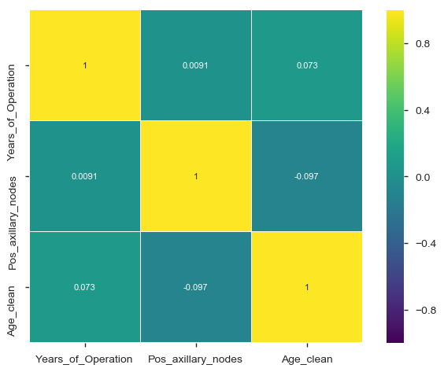
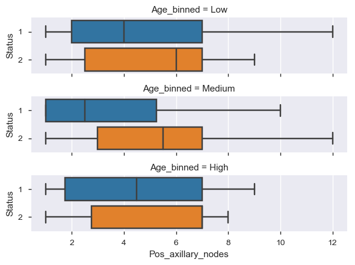

# DATA ANALYTICS WITH BREAST CANCER SURVIVAL RATE

## INTRODUCTION
More women are diagnosed with breast cancer than any other cancer,5-year survival rate tells you what percent of people live at least 5 years after the cancer is found. Percent means how many out of 100. The average 5-year survival rate for women with invasive breast cancer is 90%. The average 10-year survival rate is 83%. If the cancer is located only in the breast, the 5-year survival rate of women with breast cancer is 99%.
- But where __Data Analytics__ fit in this? 
- and is it just about __improving__ the Survival rate of Patients?

## DATA
| Column Name | Description |
| --- | --- |
| `AGE` | Numerical Value |
| `Pos_axillary_nodes ` | No of lymphs nodes | Numerical Value |
| `Years_of_Operations`| Years_of_Operations done| Numerical Value |
| `Status` | Patient survived or not |  (1=YES, 2=NO)| Numerical Value |

## PROJECT ANALYSIS

### Correlation
 
### Observation
-Age_clean and Pos_axillary_nodes has a negative correlation.
-Age_clean and Year_of_Operation has a postive correlation.
-Pos_axillary_nodes and Year_of_Operation has a postive correlation   

### Correlation among all attributes using BoxPlot

### Observation 
-If pos_axillary nodes <3, more chances of survival for any age group 

### Pairplot 
 

### Conclusion
-Low age people are likely to be survived more than 5years and longer than remaining age group people
-As Pos_axillary_nodes increase survival rate decreases
-if pos_axillary nodes are less more chance of survival of patients more than 5years or longer and maximum detect of cancer at age  group="medium"  

[Jupyter Notebook](./Code.ipynb)

